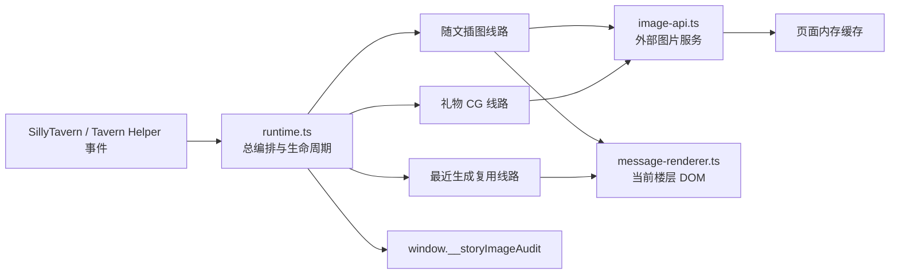
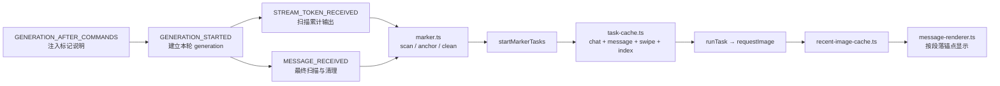
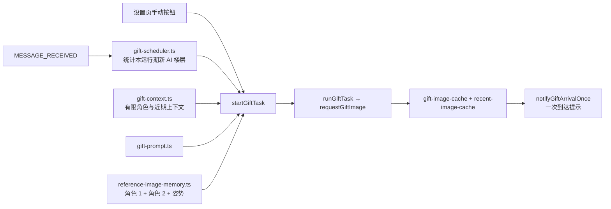
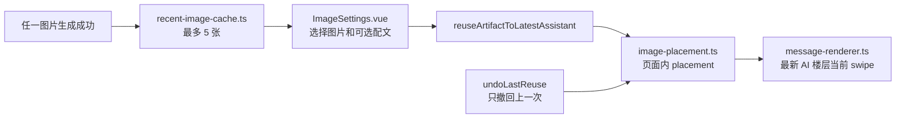
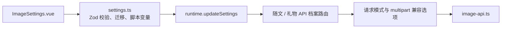

# 杠杠の生图机：代码线路图

这是一张排障地图，不是函数百科。你不需要记住每个变量；只要先确认问题发生在哪条线路，再沿着“事件 → 编排函数 → 状态/API/DOM
→ 审计”往下查。

## 一眼看懂整个脚本

入口在 `index.ts`：挂载设置界面、把设置交给 runtime、启动事件监听，并在 `pagehide` 时停止脚本。绝大多数问题先从
`runtime.ts` 找“哪一个事件触发了哪条线路”，不要一上来遍历所有模块。

## 线路一：随文插图

要点：

- 提示注入只告诉正文 AI 在合适位置输出控制标记，不把生成图片写回正文。
- 流式阶段可以提前发现标记；`MESSAGE_RECEIVED` 负责最终收口、清理标记和回写清理后的文字。
- 每条 AI 回复最多接受两张随文图。任务身份包含聊天、消息、swipe 和图片序号，防止串楼或串 swipe。
- generation 或聊天变了，旧请求即使晚回来也只能被丢弃，不能覆盖当前结果。
- 随文插图开关关闭时，这条线路必须完全静默：不扫描、不清理、不回写正文、不发随文请求；礼物 CG 仍走自己的独立开关与线路。

## 线路二：礼物 CG

要点：

- 礼物 CG 可以手动触发，也可以配置为每 3 或 5 条新 AI 回复尝试一次。
- 它是允许晚到的后台彩蛋：生成第 1～5 楼的 CG 时，用户已经聊到第 8 楼也没有问题。
- 三张参考图缺一、已有礼物任务、或请求失败时，当前机会直接跳过或失败；不排队、不补跑。
- 图片成功进入页面内存后只提示一次。通知本身失败，只能改变 `arrival_notice`，不能把已成功的礼物改成失败。
- 礼物请求会向用户配置的图片服务发送三张参考图、有限角色资料和最近最多 12 条聊天消息；排查前先确认这是用户预期的服务。

## 线路三：最近生成与复用

“复用”只改变当前页面 DOM，不修改聊天正文。刷新、脚本重载、卸载或切换聊天后，最近图片和复用位置都会消失；这是产品的轻量边界，不是恢复功能缺失。

## 设置到 API 的线路

- 提示词、API 档案和 API Key 保存在 Tavern Helper 脚本变量中；Key 是明文。
- 随文插图与礼物 CG 可以使用不同档案，但最终都由 `image-api.ts` 构造请求、设置超时并解析图片响应。
- `chat-multimodal`、`json-reference` 和 multipart 编辑请求是三种请求形态，不代表任意服务都兼容。
- multipart 的图片字段名和鉴权头属于 API 兼容层；“同一组参考图在自定义站能用、官方端点不能用”应先查这里，不要先怀疑姿势图或提示词。

## 生命周期：什么事件会清什么

| 入口事件                                                                 | runtime 的责任                                        | 常见后果                       |
| ------------------------------------------------------------------------ | ----------------------------------------------------- | ------------------------------ |
| `GENERATION_AFTER_COMMANDS`                                              | 安装本轮提示注入                                      | 正文 AI 能看到随文图标记协议   |
| `GENERATION_STARTED`                                                     | 建立新 generation，废弃旧一轮门票                     | 旧请求不得覆盖新回复           |
| `STREAM_TOKEN_RECEIVED`                                                  | 按累计快照扫描标记                                    | 可在正文结束前启动随文任务     |
| `MESSAGE_RECEIVED`                                                       | 最终扫描、必要时清理正文、登记自动礼物计数            | 随文与自动礼物在这里收口       |
| `GENERATION_ENDED`                                                       | 更新流式生命周期状态                                  | 不等于图片 API 一定已经完成    |
| `CHARACTER_MESSAGE_RENDERED` / `MESSAGE_SWIPED` / `MORE_MESSAGES_LOADED` | 按当前内存重新挂载图片 DOM                            | 只恢复本页仍在内存里的图片     |
| `MESSAGE_EDITED` / `MESSAGE_UPDATED`                                     | 重新核对对应楼层显示                                  | 防止旧锚点继续挂在改过的正文上 |
| `MESSAGE_SWIPE_DELETED` / `MESSAGE_DELETED`                              | 清理失效任务、placement 或调度状态                    | 被删楼层和 swipe 不应残留图片  |
| `CHAT_CHANGED`                                                           | 清空任务、图片、参考图、placement、调度器与审计运行态 | 新聊天不继承旧聊天页面内存     |
| `pagehide`                                                               | `stop()`：解绑事件、移除注入、释放内存与宿主 DOM      | 脚本卸载后不留后台任务         |

## 页面内存分别归谁管

| 状态           | 模块                        | 容量/身份                                   | 清除时机                           |
| -------------- | --------------------------- | ------------------------------------------- | ---------------------------------- |
| 随文任务       | `task-cache.ts`             | `chatId + messageId + swipeId + imageIndex` | 生命周期失效、删除、聊天切换或卸载 |
| 三张礼物参考图 | `reference-image-memory.ts` | 固定三槽，异步读取 latest-wins              | 清空、聊天切换或卸载               |
| 礼物任务/结果  | `gift-image-cache.ts`       | 同时一个活动任务，结果有界                  | 聊天切换、删除或卸载               |
| 最近生成       | `recent-image-cache.ts`     | 最多 5 张 artifact                          | 聊天切换或卸载                     |
| 图片复用位置   | `image-placement.ts`        | 当前页面 placement，最多 10 个              | 撤回、聊天切换、相关消息删除或卸载 |
| DOM 图片宿主   | `message-renderer.ts`       | 当前聊天已渲染楼层                          | 重绘、生命周期变化或卸载           |

`prediction-slot.ts`
目前只是内部 latest-wins 单槽和测试基础设施，没有生产入口。不要在 README 或 Release 中把它宣传成已经交付的“预测生图”。

## 文件职责地图

| 文件                                 | 只需要记住的职责                                    |
| ------------------------------------ | --------------------------------------------------- |
| `index.ts`                           | 挂载设置、启动 runtime、监听设置变化和卸载          |
| `ImageSettings.vue`                  | 设置、三参考图、生成、最近图片与复用交互            |
| `settings.ts`                        | 设置结构、旧设置迁移、脚本变量、提示注入与 API 路由 |
| `runtime.ts`                         | 所有事件的总编排、任务门控、生命周期、复用与审计    |
| `marker.ts`                          | 找随文标记、计算段落锚点、清理正文标记              |
| `task-cache.ts`                      | 随文任务身份、状态、取消与容量                      |
| `gift-scheduler.ts`                  | 自动礼物的 3/5 楼计数与跳过语义                     |
| `gift-context.ts` / `gift-prompt.ts` | 礼物使用的有限上下文与提示词组装                    |
| `gift-image-cache.ts`                | 当前礼物任务与有界结果                              |
| `reference-image-memory.ts`          | 三张参考图的页面内存与异步竞争保护                  |
| `image-api.ts`                       | 请求模式、multipart、鉴权、超时和响应解析           |
| `recent-image-cache.ts`              | 最近 5 张生成图与对象 URL 生命周期                  |
| `image-placement.ts`                 | 复用到楼层的页面内位置和上次撤回记录                |
| `message-renderer.ts`                | 段落锚点、swipe 隔离和实际 DOM 图片                 |
| `image-system.ts`                    | 图片意图、artifact 与不泄密的安全描述               |
| `prediction-slot.ts`                 | 尚未接入生产流程的内部单槽端口                      |

## 出问题先走哪条路

| 看到的症状                             | 先确认的线路        | 第一批文件/函数                                              | 先看审计                                            |
| -------------------------------------- | ------------------- | ------------------------------------------------------------ | --------------------------------------------------- |
| 设置抽屉完全不出现                     | 启动线路            | `index.ts` 的挂载与 `runtime.start()`                        | `lifecycle`，审计对象是否存在                       |
| 随文插图已关闭，正文仍被改动           | 随文入口门控        | `onMessageReceived` → `persistCleanedMessage`                | `lifecycle`、`markers`、`last_error`                |
| 原始图片标记留在正文                   | 随文清理线路        | `marker.ts` → `persistCleanedMessage`                        | `markers`、`last_error`                             |
| 有标记但一直转圈或失败                 | 随文任务线路        | `startMarkerTasks` → `runTask` → `requestImage`              | `generation`、`tasks`、`last_error`                 |
| 图片跑到错误段落或顺序乱了             | 锚点与渲染线路      | marker anchor → `positionImageHost`                          | `markers`、`tasks`、`cache`                         |
| 切 swipe 后看到另一版的图              | 任务身份线路        | task key → `renderImageTask`                                 | 任务的 `message_id`、`swipe_id`                     |
| 自动礼物没有触发                       | 礼物调度线路        | `registerAssistantReply` → `startGiftTask`                   | `gift.status`、计数与跳过原因                       |
| 礼物成功但没有弹到达提示               | 礼物收尾线路        | artifact 入缓存 → `notifyGiftArrivalOnce`                    | `gift.status`、`arrival_notice`                     |
| 本地参考图能用，URL 参考图失败         | 参考图读取线路      | `reference-image-memory.ts` → URL fetch → `requestGiftImage` | `gift.request_mode`、`last_error`；再查 CORS/防盗链 |
| 自定义图片站能图生图，官方编辑端点失败 | multipart 兼容线路  | API 档案路由 → 图片字段名/鉴权头 → `requestGiftImage`        | `gift.request_mode`、`last_error`                   |
| 最近图片突然消失                       | 生命周期线路        | `RecentImageCache` → `CHAT_CHANGED` / `stop()`               | `cache.artifact_count`                              |
| 点复用后没显示或显示错楼               | 复用线路            | `reuseArtifactToLatestAssistant` → placement → renderer      | `reuse`、`cache.placement_count`                    |
| 旧请求的图覆盖了新回复                 | generation 门控线路 | generation ticket → task cache → current-check               | `run_id`、`generation.id`、任务身份                 |
| console 或审计出现 Key、URL、Base64    | 安全描述线路        | error/response/descriptor 写入处                             | 立即作为发布阻断处理                                |

## 最小排障方法

1. 先在 `window.__storyImageAudit` 判断有没有进入正确事件和线路。
2. 如果没有进入，查事件注册、功能开关和生命周期；如果进入但没请求，查门控、任务身份和跳过原因。
3. 如果请求失败，只查 `settings.ts → API 路由 → image-api.ts`；不要先改渲染。
4. 如果请求成功但看不到，只查 cache/placement/renderer；不要再次调用 API。
5. 如果显示错楼、错 swipe 或被旧结果覆盖，只查 identity、generation ticket 和 current-check。
6. 最后再让用户判断图片内容、角色像不像和交互是否舒服；这些不能靠自动测试代替。
